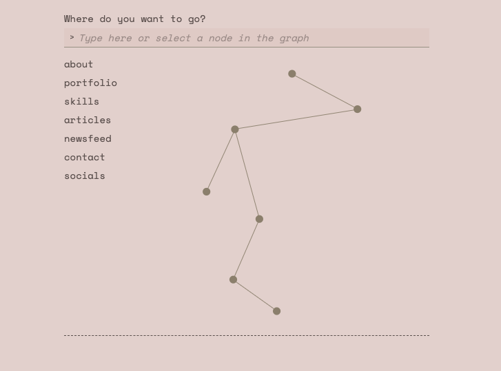

# Candice Fairand — Portfolio

A personal portfolio site with no menu: navigation happens entirely through an
Obsidian-style force-directed graph. Seven nodes — about, portfolio, skills,
articles, newsfeed, contact, socials — drift gently on screen, physically
react to being dragged, and reveal their content in a panel below the graph
when selected.

Live site: [candicefairand.com](https://candicefairand.com)



## Overview

- **Graph navigation** — built on React Flow, with two independent physics
  layers: a lightweight idle-floating animation (`requestAnimationFrame`,
  per-node randomized amplitude/frequency/phase) and a d3-force simulation
  scoped only to a node and its direct neighbors while it's being dragged,
  with elastic link stretch and a spring-back to the original position on
  release.
- **Content panel** — appears below a dashed separator once a node is
  selected, with three height/position regimes depending on how much content
  a panel has, so short content (contact form) and long content (about, full
  case studies) both feel intentional rather than either cramped or floating
  awkwardly mid-screen.
- **CMS-backed content** — the about text, portfolio case studies, articles,
  and newsfeed are all sourced live from a Ghost blog via the Content API,
  called directly with `fetch` (no `@tryghost/content-api` dependency).
- **Contact form** — handled via Web3Forms rather than a full email
  integration, chosen for compatibility with a Proton Mail-only inbox setup.

## Tech stack

- [Vite](https://vitejs.dev/) + React + TypeScript
- [React Flow](https://reactflow.dev/) (`@xyflow/react`) for the graph
- [Framer Motion](https://www.framer.com/motion/) for panel and label
  transitions
- [d3-force](https://d3js.org/d3-force) for drag physics only — node layout
  itself is fixed, not force-computed
- [Ghost Content API](https://ghost.org/docs/content-api/) for about,
  portfolio, articles, and newsfeed content
- [Web3Forms](https://web3forms.com/) for the contact form

Styling is inline styles and CSS custom properties throughout. TailwindCSS is
installed but intentionally unused — see `SPEC.md` for the reasoning and its
current status.

## Getting started

```bash
git clone https://github.com/Candyfair/my-portfolio.git
cd my-portfolio
npm install
npm run dev
```

No `.env` file is required. The Ghost Content API key and the Web3Forms
access key are both designed by their providers to be public-safe
(read-only/scoped for Ghost, an email-alias token for Web3Forms), so they're
checked in as named constants rather than environment secrets — see
`ghostClient.ts` and `ContactForm.tsx`.

```bash
npm run build      # production build
npm run preview    # preview the production build locally
```

## Documentation

Two living documents guide any further work on this project:

- [`CLAUDE.md`](./CLAUDE.md) — conventions for this project's AI-assisted
  development workflow: product decisions and architecture are mine, Claude
  Code is the implementation layer, working from prompts reviewed against
  the specs below before anything ships.
- [`SPEC.md`](./SPEC.md) — full behavioral specification: graph physics,
  panel positioning logic, per-node content behavior, and a running list of
  open design questions.

## License

Code is MIT-licensed — see [`LICENSE`](./LICENSE). The written content
(bio, project write-ups, images) is not covered and remains © Candice
Fairand.
